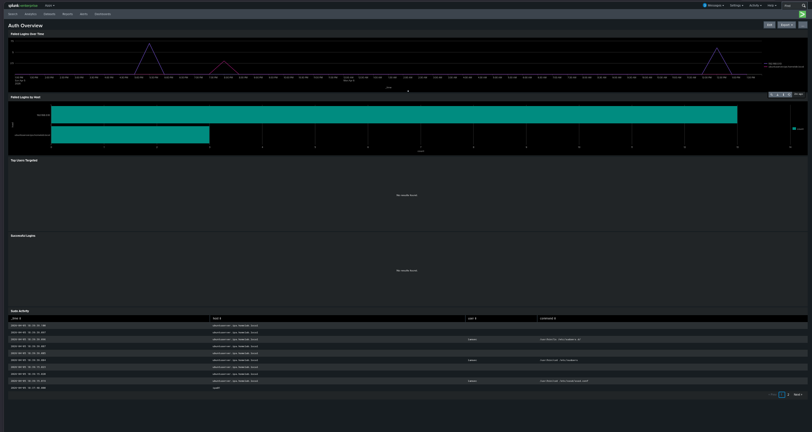
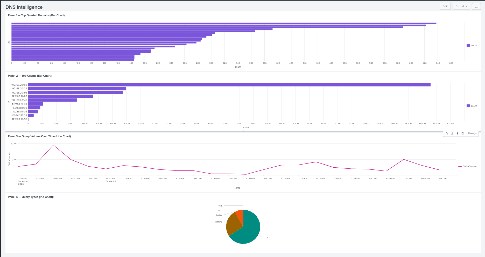
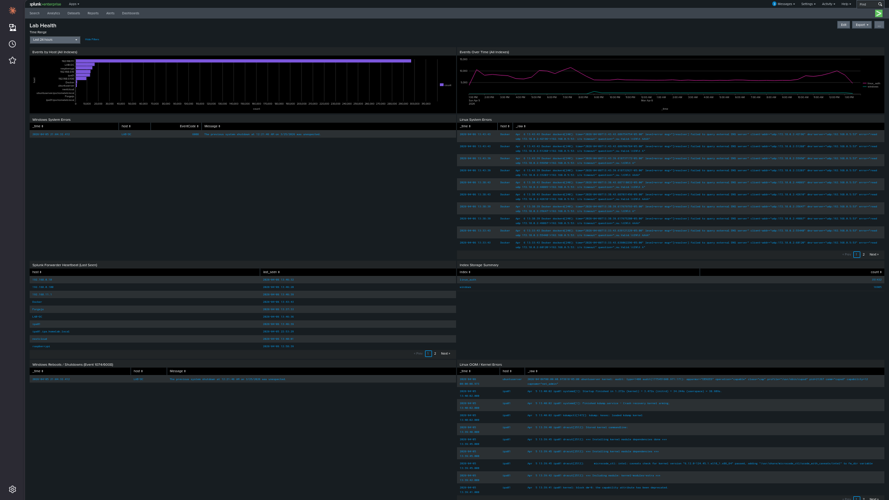
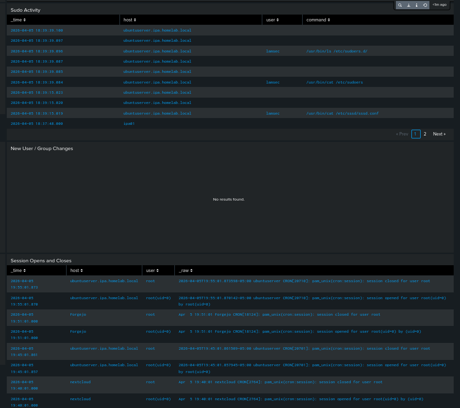
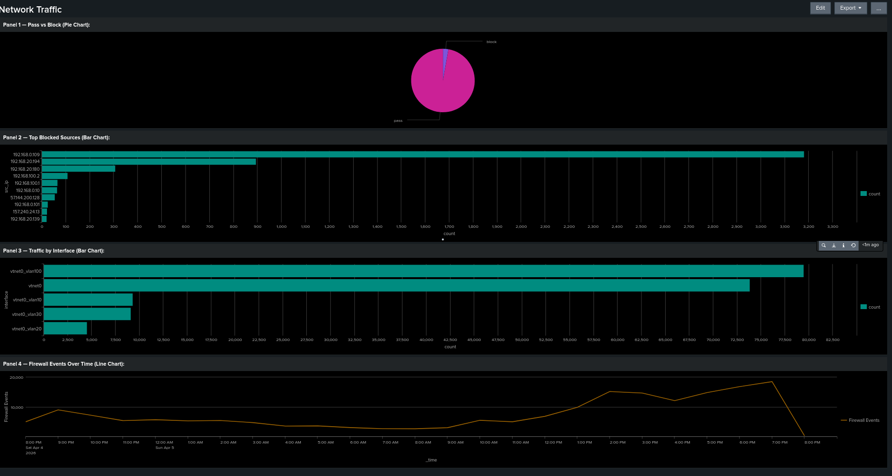

# Dashboards

7 dashboards built across authentication, security, network, DNS, and lab health.

| Dashboard | Data Sources | Key Panels |
|---|---|---|
| Auth Overview | Linux auth.log, Windows Security log | Failed/successful logins, sources, lockouts |
| Windows Security | LAB-DC Security event log | Event IDs 4624/4625/4720/4728/4732/4740/4756 |
| Linux Security | /var/log/auth.log all Linux hosts | SSH logins, sudo usage, failed auth |
| FreeIPA | Kerberos + LDAP logs | Auth failures, HBAC denies, password changes |
| Lab Health | All hosts via forwarders | Forwarder heartbeat, system errors, index storage |
| DNS Intelligence | AdGuard logs from Pi5 | Top domains, blocked queries, top clients |
| Network Traffic | OPNsense firewall logs | Denied connections, inter-VLAN flows, traffic by interface |

---

## Screenshots

### Auth Overview

### DNS Intelligence

### Lab Health

### Linux Security

### Network Traffic

